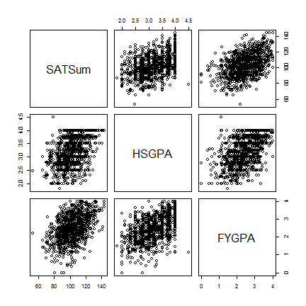
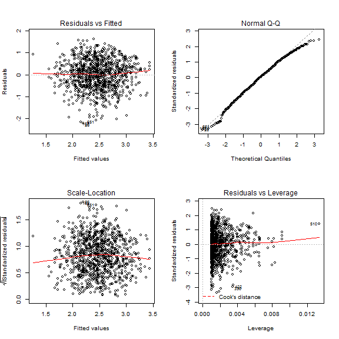
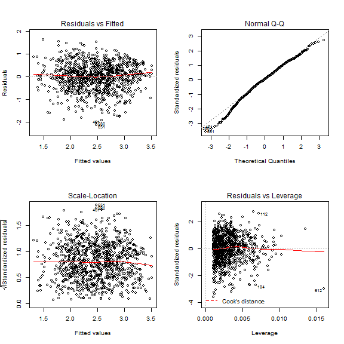

# Introduction

This activity will explore how to compare multiple regression models to find the "best" one.  The data set we will be using contains information on 1000 student's GPA in their first year of college.  Universities would like to try to predict student's GPA so they can determine who might need additional help on admission.  We will try to predict student's FYGPA (First Year GPA) using High School GPA (HSGPA) and SATSum (Sum of Math and Verbal SAT scores).

We will consider four potential models to predict GPA:

1. $FYGPA_i = \beta_0 + \epsilon_i$  (This model does not use either explanatory variable to predict FYGPA)
2. $FYGPA_i = \beta_0 + \beta_1 \times HSGPA_i + \epsilon_i$ (This model only uses HSGPA)
3. $FYGPA_i = \beta_0 + \beta_1 \times SATSum_i + \epsilon_i$ (This model only uses SATSum)
4. $FYGPA_i = \beta_0 + \beta_1 \times HSGPA_i + \beta_2 \times SATSum_i + \epsilon_i$ (This model uses both HSGPA and SATSum)

The goal is to obtain the best model, then interpret the coefficients in that model so that school administrators know how to assess these variables when deciding on admissions.

---
# Data

The data are located in the `openintro` package.  We will only be working with the $4^{th}, 5^{th}, \, \text{and} 6^{th}$ columns so I'm going to extract those.  


```r
require(openintro)
data(satGPA)
sat_sub <- satGPA[, c(4,5,6)]
head(sat_sub)
```

```
#>   SATSum HSGPA FYGPA
#> 1    127  3.40  3.18
#> 2    122  4.00  3.33
#> 3    116  3.75  3.25
#> 4     95  3.75  2.42
#> 5    107  4.00  2.63
#> 6    111  4.00  2.91
```

If you are curious about any of these variables, take a look at the help page for the data by typing `?satGPA` in R.

---
# Take Home Question 1

1) Use the scatterplot matrix below to describe the relationship between each variable and the response.  Also, comment on whether multicollinearity appears to be a problem.


```r
pairs(~SATSum + HSGPA + FYGPA, data = sat_sub)
```



--- &radio
# Hypotheses comparing models 1 and 2

We will start by seeing if $HSGPA$ is related to $FYGPA$.  To do this, we will use Model 2 from the introduction.  What are the appropriate hypotheses?

1. $H_0: \beta_0 = 0; H_A: \beta_0 \neq 0$
2. _$H_0: \beta_1 = 0; H_A: \beta_1 \neq 0$_
3. $H_0: \beta_2 = 0; H_A: \beta_2 \neq 0$
4. $H_0: \epsilon_i = 0; H_A: \epsilon_i \neq 0$

*** .hint
Which coefficient are we testing?

*** .explanation
$\beta_1$ is the coefficient which specifies the relationship between HSGPA and FYGPA.  If it is zero, then there is no linear relationship between the two.

--- &checkbox
# Assumptions Comparing Models 1 and 2

Based on the diagnostic plots, which assumptions will we assume are met?


```r
m2 <- lm(FYGPA ~ HSGPA, data = sat_sub)  ## fitting the model
par(mfrow = c(2,2))                      ## requesting 2 rows and columns
plot(m2)                                 ## plotting diagnostics
par(mfrow = c(1,1))                      ## requesting 1 row and column
```


1. _Quantitative Variables_
2. _Independence_
3. _Constant Variance_
4. Expected Counts greater than 
5. _Linearity_
6. _Normality_
7. _No Influential Points_
8. Multicollinearity

*** .hint
This is a Simple Linear Regression model.  Make sure that you are only looking at the assumptions necessary for Simple Linear Regression.

*** .explanation
Expected counts and multicollinearity are not assumptions required for SLR.  The other assumptions all appear to be valid.

--- &multitext
# Test Statistic, Distribution, and P-value


```r
summary(m2)                              ## summarizing the fitted model
```

```
#> 
#> Call:
#> lm(formula = FYGPA ~ HSGPA, data = sat_sub)
#> 
#> Residuals:
#>     Min      1Q  Median      3Q     Max 
#> -2.3054 -0.3742  0.0394  0.4191  1.7524 
#> 
#> Coefficients:
#>             Estimate Std. Error t value Pr(>|t|)
#> (Intercept)   0.0913     0.1179    0.77     0.44
#> HSGPA         0.7431     0.0363   20.45   <2e-16
#> 
#> Residual standard error: 0.622 on 998 degrees of freedom
#> Multiple R-squared:  0.295,	Adjusted R-squared:  0.295 
#> F-statistic:  418 on 1 and 998 DF,  p-value: <2e-16
```

1. What is the appropriate test statistic?
2. It is assumed to follow a $t$ distribution with how many degrees of freedom? (Recall that $n = 1000$)
3. What is the p-value (if it is less that 0.001, enter 0)

*** .hint
These can all be found in the summary output by looking in the appropriate places.

*** .explanation
1. <span class = "answer">20.45</span>
The test statistic is the `t value`
2. <span class = "answer">998</span>
There are $n = 1000$ students and we are estimating two coefficients so the degrees of freedom = $1000 - 2 = 998$.
3. <span class = "answer">0</span>
The actual p-value is less than $2 * 10^{-16}$

--- &submitcompare1
# Decision and Conclusion comparing model 1 & 2

What is your decision?  Write a conclusion in the context of the problem.

*** .explanation
Reject the null.  There is strong evidence that there is a linear relationship between high school GPA and first year GPA in college in the population of students.

---
# Take Home Question 2

Next, we want to test for an effect of SATSum.  We can perform a similar process as before by comparing a model with only SATSum as an explanatory variable to a model with no explanatory variables.  

2) Use the diagnostic plots and summary output below to perform the six steps of a hypothesis test comparing models 1 and 3.

Diagnostic plots


```r
m3 <- lm(FYGPA ~ SATSum, data = sat_sub)
par(mfrow = c(2,2))
plot(m3)
par(mfrow = c(1,1))
```



Model Summary


```r
summary(m3)
```

```
#> 
#> Call:
#> lm(formula = FYGPA ~ SATSum, data = sat_sub)
#> 
#> Residuals:
#>     Min      1Q  Median      3Q     Max 
#> -2.1976 -0.4495  0.0315  0.4557  1.6115 
#> 
#> Coefficients:
#>             Estimate Std. Error t value Pr(>|t|)
#> (Intercept)  0.00193    0.15199    0.01     0.99
#> SATSum       0.02387    0.00146   16.38   <2e-16
#> 
#> Residual standard error: 0.658 on 998 degrees of freedom
#> Multiple R-squared:  0.212,	Adjusted R-squared:  0.211 
#> F-statistic:  268 on 1 and 998 DF,  p-value: <2e-16
```

--- &radio
# Hypotheses comparing models 3 vs 4

We have decided that both FYGPA and SATSum are important predictors **on their own**.  Now we will test to see if they are important together.  

First we will test to see if HSGPA is important after accounting for SATSum.  Which model should we perform the hypothesis test on?  What is the appropriate null hypothesis?

1. Model 2; $H_0: \beta_1 = 0$
2. Model 3; $H_0: \beta_1 = 0$
3. _Model 4; $H_0: \beta_1 = 0$_
4. Model 4; $H_0: \beta_2 = 0$

*** .hint
Which model estimates the effect of HSGPA controlling for SATSum?

*** .explanation
Model 4 estimates the effect of both HSGPA and SATSum after controlling for the other.

--- &checkbox
# Assumptions comparing models 3 vs 4

Based on the diagnostic plots, which assumptions will we assume are met?


```r
m4 <- lm(FYGPA ~ HSGPA + SATSum, data = sat_sub)  
par(mfrow = c(2,2))                  
plot(m4)                             
par(mfrow = c(1,1))                 
```



Here are the Variance Inflation Factors


```r
require(car)
vif(m4)
```

```
#>  HSGPA SATSum 
#>   1.23   1.23
```


1. _Quantitative Variables_
2. _Independence_
3. _Constant Variance_
4. Expected Counts greater than 
5. _Linearity_
6. _Normality_
7. _No Influential Points_
8. _Multicollinearity_

*** .hint
This is a Multiple Linear Regression model.  Make sure that you are only looking at the assumptions necessary for MLR.

*** .explanation
Expected counts still is not necessary.  The VIFs are small so multicollinearity is met.


--- &multitext
# Test Statistic, Distribution, and P-value


```r
summary(m4)                       
```

```
#> 
#> Call:
#> lm(formula = FYGPA ~ HSGPA + SATSum, data = sat_sub)
#> 
#> Residuals:
#>     Min      1Q  Median      3Q     Max 
#> -2.1189 -0.3413  0.0243  0.4095  1.6237 
#> 
#> Coefficients:
#>             Estimate Std. Error t value Pr(>|t|)
#> (Intercept) -0.87343    0.14903   -5.86  6.3e-09
#> HSGPA        0.57949    0.03846   15.07  < 2e-16
#> SATSum       0.01440    0.00146    9.88  < 2e-16
#> 
#> Residual standard error: 0.594 on 997 degrees of freedom
#> Multiple R-squared:  0.358,	Adjusted R-squared:  0.357 
#> F-statistic:  278 on 2 and 997 DF,  p-value: <2e-16
```

1. What is the appropriate test statistic?
2. It is assumed to follow a $t$ distribution with how many degrees of freedom? (Recall that $n = 1000$)
3. What is the p-value (if it is less that 0.001, enter 0)

*** .hint
These can all be found in the summary output by looking in the appropriate places.

*** .explanation
1. <span class = "answer">15.07</span>
The test statistic is the `t value`
2. <span class = "answer">997</span>
There are $n = 1000$ students and we are estimating three coefficients so the degrees of freedom = $1000 - 3 = 997$.
3. <span class = "answer">0</span>
The actual p-value is less than $2 * 10^{-16}$

--- &submitcompare1
# Decision and Conclusion comparing model 3 & 4

What is your decision?  Write a conclusion in the context of the problem.

*** .explanation
Reject the null.  There is strong evidence that there is a linear relationship between high school GPA and first year GPA in college in the population of students after accounting for the student's total SAT score.

---
# Take Home Question 3

We have decided that HSGPA is important after accounting for SAT score.  Now, we will test to see if SAT score is important after accounting for HSGPA.

3) Use the diagnostic plots and summary output above to perform the six steps of a hypothesis test for an effect of SATSum after accounting for HSGPA.

--- &radio
# Comparing models using Adjusted $R^2$

Instead of performing hypothesis tests using Adjusted $R^2$.  Here are the adjusted $R^2$ for the four models.

<div class = "table table-hover table-bordered">

<table>
 <thead>
  <tr>
   <th style="text-align:left;"> Explanatory Variables </th>
   <th style="text-align:right;"> Adjusted $R^2$ </th>
  </tr>
 </thead>
<tbody>
  <tr>
   <td style="text-align:left;"> none </td>
   <td style="text-align:right;"> 0.000 </td>
  </tr>
  <tr>
   <td style="text-align:left;"> HSGPA </td>
   <td style="text-align:right;"> 0.295 </td>
  </tr>
  <tr>
   <td style="text-align:left;"> SATSum </td>
   <td style="text-align:right;"> 0.211 </td>
  </tr>
  <tr>
   <td style="text-align:left;"> HSGPA, SATSum </td>
   <td style="text-align:right;"> 0.357 </td>
  </tr>
</tbody>
</table>

</div>

Using Adjusted $R^2$, which model is preferred?

1. Model 1
2. Model 2
3. Model 3
4. _Model 4_

*** .hint
Recall that larger Adjusted $R^2$ suggest a better fit

*** .explanation
Model 4 has the largest Adjusted $R^2$

---
# Take Home Question 4

Using both hypothesis tests and adjusted $R^2$, we decided that both explanatory variables are important.  So model 4 is preferable.

4) Provide 95% confidence intervals for both coefficients.  Use $t^*$

---
# Take Home Question 5

We found that both variables have a statistically significant relationship with a college student's First Year GPA.  However, the $R^2$ for this model is 0.358 so only 35.8% of the variability in First Year GPA is explained by High School GPA and SAT score.

5) 

---
# Take Home Question 6

6) Write a scope of inference for these data.


